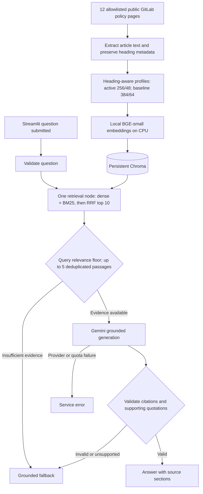

# Architecture

Delivered P1 uses local hybrid retrieval with 256-token chunks and 48-token overlap. The P0 dense 384 / 64 baseline and its results are preserved. The same metadata accompanies each passage through indexing, evidence selection, generation, citation validation and display, allowing answers to be traced to saved policy sections.

## Components and boundaries

| Component | Responsibility | External access |
|---|---|---|
| Ingestion | Fetch the allowlist, extract text, retain source metadata, create chunks and index | Public handbook during ingestion |
| Embeddings | Encode documents and questions with `BAAI/bge-small-en-v1.5` | Initial model download only; local CPU inference afterward |
| Chroma | Persist and query document vectors | Local storage |
| LangGraph | Route validation, retrieval, evidence gate, generation, citation checking and fallback | Generation node calls Gemini |
| Streamlit | Submit a question and display answer, source links, evidence and latency | Local browser and loopback server |
| Evaluation | Measure retrieval; collect generated answers; support human review | Gemini only for full generation evaluation |

LangChain integrations supply embedding, vector-store and model interfaces. LangGraph expresses conditional control flow. Dense retrieval, BM25 and RRF execute sequentially inside one retrieval node, not parallel graph branches. BM25 uses k1=1.5 and b=0.75; equal-weight RRF sums reciprocal ranks with k=60 over dense top ten and sparse top ten. Raw BM25 and cosine scores are not added. There is no reranker, query rewriting or autonomous agent loop.

## Data and configuration

`app/config.py` defines local configuration and `app/profiles.py` selects a reproducible profile. Active 256 / 48 uses `data/processed/chunks256/chunks.jsonl` and Chroma collection `gitlab_policy_bge_256`. The 384 / 64 baseline retains its own files and collection. Retrieval returns ten candidates; evidence selection retains at most five deduplicated passages. Hybrid rows retain real cosine similarity separately from BM25 and RRF scores.

P1 uses a query-level relevance floor, approximately 0.656756, derived from the weakest positive development score minus a fixed 0.02 margin. When the selected evidence clears it, complementary top-five passages are retained rather than individually filtered out. It accepts all three positive development questions but also two of three negative questions: generation must still abstain when evidence does not answer the question. P0's per-passage threshold 0.7770809961 remains preserved: 2/3 positives accepted and 3/3 negatives rejected. Neither threshold is confidence or proof of answerability.

The model cache and Chroma directory remain in the project. A local `.env` supplies the Gemini key; it is excluded from Git and never displayed in the UI. LangSmith tracing and relevant anonymous telemetry settings are disabled. The server binds to loopback rather than the public network.

Citation metadata includes document identity, title, canonical source URL, section name and section URL where available. HTML headings replace PDF page numbers. A source’s visible update date is distinct from its policy-effective date. Content checksums and capture dates identify the static snapshot.

## Grounding and failure behavior

Retrieved material is evidence, not an instruction source. Generation is constrained to supplied evidence; the prompt must reject instructions embedded in documents or user attempts to override grounding. The citation validator checks that evidence identifiers refer to retrieved passages and quoted support exists in those passages.

These checks do not establish semantic entailment. A claim can cite genuine text and still misinterpret a condition, exception or jurisdiction. The evaluation therefore separates mechanical citation validity from human-scored correctness and faithfulness.

Insufficient evidence returns a policy fallback. Missing configuration, quota exhaustion or model failure returns a service error. The UI distinguishes them and avoids exposing exception details. The latest response is stored in Streamlit session state; rerendering does not automatically generate another answer.

## Evaluation boundaries

Use a development set for threshold calibration and keep the 15-question final set separate. Calculate retrieval metrics only for questions with labelled answer evidence. Include deliberate unanswerable and ambiguity cases to measure fallback behavior separately. Preserve latency and per-question retrieval results for diagnosis.

The P0 baseline achieved 77.8% Hit@5 and mean passage Recall@5 over nine answerable questions; P1 hybrid reached 88.9%. The development selector chose 256 dense on context cost; active hybrid is an explicit approved product choice. Within hybrid, 256 / 48 wins on lower development context size at equal quality. See `docs/comparison.md` for all four configurations.

The P1 generation run answered eight of nine answerable questions but also incorrectly answered a personal legal-entitlement question. Five of six expected fallbacks succeeded; there were no provider errors. This semantic failure passed quotation validation. A post-evaluation P1 scope guard now handles personal legal/statutory-entitlement requests before retrieval; targeted verification is separate from the unchanged full run. P1 reuses previously inspected final questions, making it a diagnostic follow-up rather than a new held-out estimate or human faithfulness result.
